1. Introduction
---------------

Coronaviruses are a family of human pathogens and have been responsible
for a variety of respiratory diseases in humans ranging from common cold
to dangerous ones like SARS (Severe Acute Respiratory) and MERS (Middle
East Respiratory Syndrome). At the end of 2019, a novel strain of
coronavirus was identified as a casue of pneumonia-type illness in
Wuhan, Hubei in China. The virus was highly contagious and rapidly
spread throughout the city. Though the Chinese government ordered
lockdown of the city, the virus had spread to different parts of the
world resulting in a global pandemic of a massive scale in February
2020. The virus has been named as 2019-nCov and the disease has been
termed as COVID-19 (Coronavirus disease 2019).

The understanding of the virus is evolving and several models have been
proposed to find the basic reproducibility number (denoted by
*R*0), case fatality rate and case recovery rate. In this
study, we use epidemic transmission dynamics based compartmental model
called ***SIRD model*** to study the progression of the disease for
different countries (in particular, Germany and India). We use the
discrete approximations as in \[1\] to estimate the *R*0 ,
case mortality and case recovery rates and analyse the changes as time
progresses. Furthermore, we fit the model to the epidemic curves of
these countries to make forecasts about the peak of the epidemic and the
flattening of the curve.

2. Data visualization and exploratory analysis
----------------------------------------------

The COVID-19 data used in this analysis is available on the public git
repository
[COVID](https://github.com/CSSEGISandData/COVID-19/tree/master/csse_covid_19_data/csse_covid_19_time_series).
The data has the time series of confirmed, recovered and death cases of
COVID-19 for various countries. The first five rows of confirmed cases
database look like this:

    confirmed <- read.csv("data/time_series_covid19_confirmed_global.csv")

    deaths <- read.csv("data/time_series_covid19_deaths_global.csv")

    recovered <- read.csv("data/time_series_covid19_recovered_global.csv")

    head(confirmed, 5)

    ##   Province.State Country.Region      Lat    Long X1.22.20 X1.23.20 X1.24.20
    ## 1                   Afghanistan  33.0000 65.0000        0        0        0
    ## 2                       Albania  41.1533 20.1683        0        0        0
    ## 3                       Algeria  28.0339  1.6596        0        0        0
    ## 4                       Andorra  42.5063  1.5218        0        0        0
    ## 5                        Angola -11.2027 17.8739        0        0        0
    ##   X1.25.20 X1.26.20 X1.27.20 X1.28.20 X1.29.20 X1.30.20 X1.31.20 X2.1.20
    ## 1        0        0        0        0        0        0        0       0
    ## 2        0        0        0        0        0        0        0       0
    ## 3        0        0        0        0        0        0        0       0
    ## 4        0        0        0        0        0        0        0       0
    ## 5        0        0        0        0        0        0        0       0
    ##   X2.2.20 X2.3.20 X2.4.20 X2.5.20 X2.6.20 X2.7.20 X2.8.20 X2.9.20 X2.10.20
    ## 1       0       0       0       0       0       0       0       0        0
    ## 2       0       0       0       0       0       0       0       0        0
    ## 3       0       0       0       0       0       0       0       0        0
    ## 4       0       0       0       0       0       0       0       0        0
    ## 5       0       0       0       0       0       0       0       0        0
    ##   X2.11.20 X2.12.20 X2.13.20 X2.14.20 X2.15.20 X2.16.20 X2.17.20 X2.18.20
    ## 1        0        0        0        0        0        0        0        0
    ## 2        0        0        0        0        0        0        0        0
    ## 3        0        0        0        0        0        0        0        0
    ## 4        0        0        0        0        0        0        0        0
    ## 5        0        0        0        0        0        0        0        0
    ##   X2.19.20 X2.20.20 X2.21.20 X2.22.20 X2.23.20 X2.24.20 X2.25.20 X2.26.20
    ## 1        0        0        0        0        0        1        1        1
    ## 2        0        0        0        0        0        0        0        0
    ## 3        0        0        0        0        0        0        1        1
    ## 4        0        0        0        0        0        0        0        0
    ## 5        0        0        0        0        0        0        0        0
    ##   X2.27.20 X2.28.20 X2.29.20 X3.1.20 X3.2.20 X3.3.20 X3.4.20 X3.5.20 X3.6.20
    ## 1        1        1        1       1       1       1       1       1       1
    ## 2        0        0        0       0       0       0       0       0       0
    ## 3        1        1        1       1       3       5      12      12      17
    ## 4        0        0        0       0       1       1       1       1       1
    ## 5        0        0        0       0       0       0       0       0       0
    ##   X3.7.20 X3.8.20 X3.9.20 X3.10.20 X3.11.20 X3.12.20 X3.13.20 X3.14.20 X3.15.20
    ## 1       1       4       4        5        7        7        7       11       16
    ## 2       0       0       2       10       12       23       33       38       42
    ## 3      17      19      20       20       20       24       26       37       48
    ## 4       1       1       1        1        1        1        1        1        1
    ## 5       0       0       0        0        0        0        0        0        0
    ##   X3.16.20 X3.17.20 X3.18.20 X3.19.20 X3.20.20 X3.21.20 X3.22.20 X3.23.20
    ## 1       21       22       22       22       24       24       40       40
    ## 2       51       55       59       64       70       76       89      104
    ## 3       54       60       74       87       90      139      201      230
    ## 4        2       39       39       53       75       88      113      133
    ## 5        0        0        0        0        1        2        2        3
    ##   X3.24.20 X3.25.20 X3.26.20 X3.27.20 X3.28.20 X3.29.20 X3.30.20 X3.31.20
    ## 1       74       84       94      110      110      120      170      174
    ## 2      123      146      174      186      197      212      223      243
    ## 3      264      302      367      409      454      511      584      716
    ## 4      164      188      224      267      308      334      370      376
    ## 5        3        3        4        4        5        7        7        7
    ##   X4.1.20 X4.2.20 X4.3.20 X4.4.20 X4.5.20 X4.6.20 X4.7.20 X4.8.20 X4.9.20
    ## 1     237     273     281     299     349     367     423     444     484
    ## 2     259     277     304     333     361     377     383     400     409
    ## 3     847     986    1171    1251    1320    1423    1468    1572    1666
    ## 4     390     428     439     466     501     525     545     564     583
    ## 5       8       8       8      10      14      16      17      19      19
    ##   X4.10.20 X4.11.20 X4.12.20 X4.13.20 X4.14.20 X4.15.20 X4.16.20 X4.17.20
    ## 1      521      555      607      665      714      784      840      906
    ## 2      416      433      446      467      475      494      518      539
    ## 3     1761     1825     1914     1983     2070     2160     2268     2418
    ## 4      601      601      638      646      659      673      673      696
    ## 5       19       19       19       19       19       19       19       19
    ##   X4.18.20 X4.19.20 X4.20.20 X4.21.20 X4.22.20 X4.23.20 X4.24.20 X4.25.20
    ## 1      933      996     1026     1092     1176     1279     1351     1463
    ## 2      548      562      584      609      634      663      678      712
    ## 3     2534     2629     2718     2811     2910     3007     3127     3256
    ## 4      704      713      717      717      723      723      731      738
    ## 5       24       24       24       24       25       25       25       25
    ##   X4.26.20 X4.27.20 X4.28.20 X4.29.20 X4.30.20 X5.1.20 X5.2.20 X5.3.20 X5.4.20
    ## 1     1531     1703     1828     1939     2171    2335    2469    2704    2894
    ## 2      726      736      750      766      773     782     789     795     803
    ## 3     3382     3517     3649     3848     4006    4154    4295    4474    4648
    ## 4      738      743      743      743      745     745     747     748     750
    ## 5       26       27       27       27       27      30      35      35      35
    ##   X5.5.20 X5.6.20 X5.7.20 X5.8.20 X5.9.20
    ## 1    3224    3392    3563    3778    4033
    ## 2     820     832     842     850     856
    ## 3    4838    4997    5182    5369    5558
    ## 4     751     751     752     752     754
    ## 5      36      36      36      43      43

We can see the data starts from January 22, 2020 and gives us the number
of confirmed cases on each date since then till now.

Below we plot the progression of the disease (confirmed, recovered,
deaths) in a few selected countries.

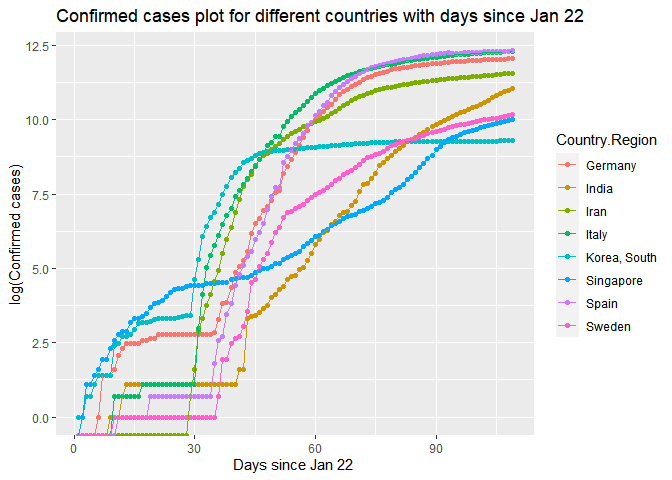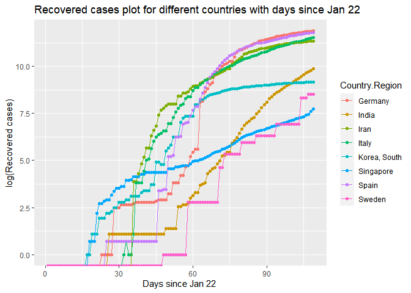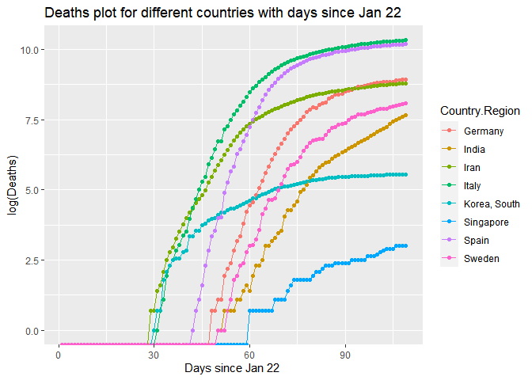

We can see from the plots that South Korea has successfully flattened
the curve and countries like Germany and Italy have started flattening.
On the other hand, India and Singapore are still far from flattening the
curve.

3. Formulation of SIRD model
----------------------------

In this section, we discuss the basics of the SIRD model to simulate
epidemic progression with time.

### 3.1 Discrete model

Within this model of the evolution of an epidemic outbreak, people can
be divided into different classes. In the susceptible (S), infected (I),
recovered (R), dead (D) scheme (SIRD), any individual in the fraction of
the overall population that will eventually get sick belongs to one of
the aforementioned classes. Let N be the size of the initial population
of susceptible people. The discrete SIRD model can be written as
follows:

$$
\\begin{aligned}
S(t) - S(t-1) = -\\frac{\\alpha}{N} S(t-1)I(t-1), \\\\
I(t) - I(t-1) = \\frac{\\alpha}{N} S(t-1)I(t-1) - \\beta I(t-1) - \\gamma I(t-1), \\\\
R(t) - R(t-1) = \\beta I(t-1), \\\\
D(t) - D(t-1) = \\gamma I(t-1),
\\end{aligned}
$$

The basic reproduction number *R*0 is then defined as
$$
\\begin{aligned}
R\_{0} := \\frac{\\alpha}{\\beta + \\gamma}. 
\\end{aligned}
$$

Since the number of susceptible people is hard to determine and depends
on the population, lockdown measures, social distancing etc, we take a
different approach to estimate *R*0 as mentioned in Ref 1.
Let us denote *Δ**X*(*t*):=*X*(*t*)−*X*(*t* − 1) for
*X* = *I*, *R*, *D*. Now we define,
$$
\\begin{aligned}
C\\Delta X(T) := \\sum\_{t=1}^{T} \\Delta X(t) \\textit{,     and  }\\\\ 
\\mathbf{C \\Delta X} (T) := \[C\\Delta X(1), C\\Delta X(2), ..., C\\Delta X(T)\]^{T} . 
\\end{aligned}
$$

Here C stands for cumulative. Using the approximation *S*(*t* − 1)≈*N*
(true if susceptible population is much less than the population of the
country), we can get
$$
\\begin{aligned}
R\_{0} = \\frac{\\alpha}{\\beta + \\gamma} = \\frac{I(t) - I(t-1) + R(t) - R(t-1) + D(t) - D(t-1)}{R(t) - R(t-1) + D(t) - D(t-1)}.
\\end{aligned}
$$
 Summing this equation over time we get,
$$
\\begin{aligned}
\\frac{C\\Delta I(t) +C\\Delta R(t) + C\\Delta D(t) }{C\\Delta R(t) + C \\Delta D(t)} = R\_{0}.
\\end{aligned}
$$
 Based on this, we can get a coarse estimate for *R*0 by
finding a least squares solution to the following regression problem:  
$$
\\begin{aligned}
\[\\mathbf{C\\Delta I(t) +C\\Delta R(t) + C\\Delta D(t)}\] = \[\\mathbf{C\\Delta R(t) + C \\Delta D(t)}\] R\_{0}, 
\\end{aligned}
$$
 with solution given by
$$
\\begin{aligned}
\\hat{R}\_{0} = (\[\\mathbf{C\\Delta R(t) + C \\Delta D(t)}\]^{T}\[\\mathbf{C\\Delta R(t) + C \\Delta D(t)}\])^{-1} \[\\mathbf{C\\Delta R(t) + C \\Delta D(t)}\]^{T}  \[\\mathbf{C\\Delta I(t) +C\\Delta R(t) + C\\Delta D(t)}\].
\\end{aligned}
$$

Similarly, the case fatality rate ($\\hat{\\beta}$) and case recovery
rate ($\\hat{\\gamma}$) can be estimated as:
$$
 \\begin{aligned}
 \\hat{\\beta} = (\[\\mathbf{C\\Delta I(t) }\]^{T}\[\\mathbf{C\\Delta I(t) }\])^{-1} \[\\mathbf{C\\Delta I(t)}\]^{T}  \[\\mathbf{C\\Delta R(t) }\], \\\\
 \\hat{\\gamma} = (\[\\mathbf{C\\Delta I(t) }\]^{T}\[\\mathbf{C\\Delta I(t)}\])^{-1} \[\\mathbf{C\\Delta I(t) }\]^{T}  \[\\mathbf{ C\\Delta D(t)}\].
 \\end{aligned}
 $$

### 3.2. Continuous model

In the continuous, the number of people in each class is a function of
conitnuous time. So S(t) denotes the susceptible people at a time t. The
mean-field kinetics of the SIRD epidemic evolution is described by the
following system of differential equations:

$$
\\begin{aligned}
\\frac{dS}{dt} = -\\frac{\\alpha}{N} S(t)I(t), \\\\
\\frac{dI}{dt} = \\frac{\\alpha}{N} S(t)I(t) - \\beta I(t) - \\gamma I(t), \\\\
\\frac{dR}{dt} = \\beta I(t), \\\\
\\frac{dD}{dt} = \\gamma I(t) ,
\\end{aligned}
$$

with initial condition
\[*S*(*t*0),*I*(*t*0),*R*(*t*0),*D*(*t*0)\]
for some initial time *t*0. The parameter *α* is the
infection rate, i.e. the probability per unit time that a susceptible
individual contracts the disease when entering in contact with an
infected person. The parameters *β* and *γ* denote, respectively, the
recovery and death rates. This scheme has good chances to capture at
least the gross features of the full time course of the outbreak.

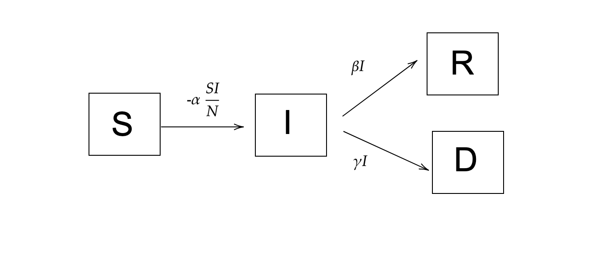{Above figures shows SIRD model classes and
change per unit time shown above arrows.}

4 Results
---------

In this section we present our results for basic reproduction number,
case fatality rate, case recovery ratios and time series forecasting for
Germany and India.

### 4.1 Results for Germany

We first use the discrete model to find these parameters and predict
time series for Germany. We use the time series data available and for
the required vectors **C****Δ****X**(*T*) for *X* = *I*, *R*, *D*.

    country = "Germany" #Country chosen

    #Extract country data from countries data
    germany_cnf_melt = confirmed_countries_melt[which(confirmed_countries_melt$Country.Region == country), ]

    #Extract confirmed number  as a vector
    germany_cnf = germany_cnf_melt$value

    #Extract delta infected vector delta_cnf(t) = I(t) - I(t-1)
    germany_delta_cnf = diff(germany_cnf)

    #Cumulative sum of delta_cnf
    germany_cum_delta_cnf = cumsum(germany_delta_cnf)

    germany_deaths_melt = deaths_countries_melt[which(deaths_countries_melt$Country.Region == country), ]

    #Extract deaths number as a vector
    germany_deaths = germany_deaths_melt$value

    #Extract delta deathsvector delta_deaths(t) = D(t) - D(t-1)
    germany_delta_deaths = diff(germany_deaths)

    #Cumulative sum of delta_deaths
    germany_cum_delta_deaths = cumsum(germany_delta_deaths)

    #Extract germany data from countries recovered data
    germany_recovered_melt = recovered_countries_melt[which(recovered_countries_melt$Country.Region == country), ]

    #Extract recovered number as a vector
    germany_recovered = germany_recovered_melt$value

    #Extract delta recovered vector delta_recovered(t) = R(t) - R(t-1)
    germany_delta_recovered = diff(germany_recovered)

    #Cumulative sum of delta_recovered
    germany_cum_delta_recovered = cumsum(germany_delta_recovered)

    ### Caluclating infected numbers from confirmed cases
    #Extract infected number cases as a vector
    germany_inf = germany_cnf - germany_recovered - germany_deaths

    #Extract delta infected vector delta_inf(t) = I(t) - I(t-1)
    germany_delta_inf = diff(germany_inf)

    #Cumulative sum of delta_inf
    germany_cum_delta_inf = cumsum(germany_delta_inf)

We then use different time windows to estimate the time evolution of
these parameters.

    ###ESTIMATING CASE FATALITY RATIO

    #Making data frame of cumulative data
    germany_cum_data_full = data.frame(delta_inf= germany_delta_inf, cum_delta_inf=germany_cum_delta_inf, delta_recovered = germany_delta_recovered, cum_delta_recovered= germany_cum_delta_recovered, delta_deaths = germany_delta_deaths, cum_delta_deaths=germany_cum_delta_deaths)

    ##VARY THE NUMBER OF DAYS CHOSEN FOR ANALYSIS
    ndays = 65:97
    gamma_data <- data.frame(matrix(ncol = 3, nrow = 0))
    x <- c("est", "lwr", "upr")
    colnames(gamma_data) <- x

    beta_data <- data.frame(matrix(ncol = 3, nrow = 0))
    x <- c("est", "lwr", "upr")
    colnames(beta_data) <- x

    R0_data <- data.frame(matrix(ncol = 3, nrow = 0))
    x <- c("est", "lwr", "upr")
    colnames(R0_data) <- x

    #loop over days window chosen
    for (days in ndays) {
      
    germany_cum_data = germany_cum_data_full[1:days, ]
    #View(germany_cum_data)

    #fitting a linear model for case fatality ratio
    germany_gamma <- lm(cum_delta_deaths ~ cum_delta_inf  -1  , data=germany_cum_data)  # build linear regression model on full data

    ###ESTIMATING CASE  RECOVERY RATIO
    cor(germany_cum_delta_inf, germany_cum_delta_recovered)
    #high correlation 
    #fitting a linear model for case recovery ratio
    germany_beta <- lm(cum_delta_recovered ~ cum_delta_inf -1 , data=germany_cum_data)  # build linear regression model on full data with no intercept

    ###ESTIMATING R0
    #fitting a linear model for case basic reproducibility number R0
    germany_R0 <- lm(cum_delta_deaths + cum_delta_recovered + cum_delta_inf  ~ I(cum_delta_recovered + cum_delta_deaths) - 1  , data=germany_cum_data)  # build linear regression model on full data

    ##Storing estimations and conf intervals

    conf = confint(germany_gamma)
    gamma_row <- list(est = summary(germany_gamma)$coefficients[1], lwr = conf[1], upr = conf[2])

    gamma_data = rbind(gamma_data, gamma_row)

    conf = confint(germany_beta)
    beta_row <- list(est = summary(germany_beta)$coefficients[1], lwr = conf[1], upr = conf[2])

    beta_data = rbind(beta_data, beta_row)

    conf = confint(germany_R0)
    R0_row <- list(est = summary(germany_R0)$coefficients[1], lwr = conf[1], upr = conf[2])

    R0_data = rbind(R0_data, R0_row)

    }

We plot plot the estimates and the corresponding 99% confidence
intervals for $R\_{0}, \\hat{\\beta}, \\hat{\\gamma}$ as below.

    ggplot(R0_data, aes(ndays, est)) + geom_point() + geom_line(aes(ndays, est)) + geom_ribbon(aes(ymin=lwr,ymax=upr), alpha=0.5) + xlab("Number of days since Jan 22") + ylab("R0") + ggtitle("Germany: R0 estimate evolution ")

    ggplot(beta_data, aes(ndays, est)) + geom_point() + geom_line(aes(ndays, est)) + geom_ribbon(aes(ymin=lwr,ymax=upr), alpha=0.5) + xlab("Number of days since Jan 22") + ylab("case recovery ratio") + ggtitle("Germany: case recovery ratio estimate evolution ")

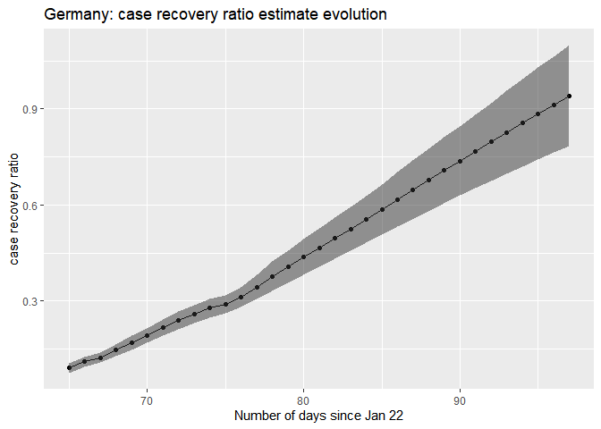

    ggplot(gamma_data, aes(ndays, est)) + geom_point() + geom_line(aes(ndays, est)) + geom_ribbon(aes(ymin=lwr,ymax=upr), alpha=0.5) + xlab("Number of days since Jan 22") + ylab(" case fatality ratio") + ggtitle(" Germany: case fatality ratio estimate evolution ")

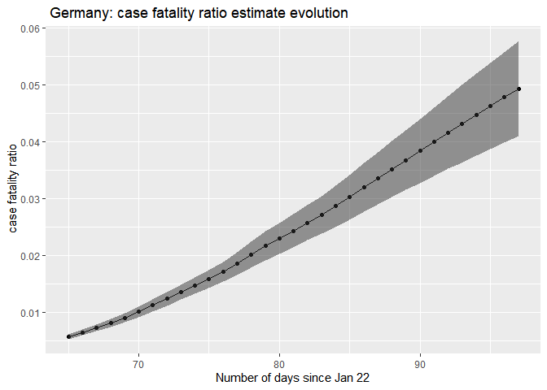

From these, we can see that the *R*0 for Germany has come
down from 8.2 to 1.6 (99% CI : \[1.5 1.7\]). This is good news and
indicates flattening of the curve. Note that if *R*0 &lt; 1,
the disease stops spreading. The case recovery ratio is going up and has
reached approximately 0.9 while the case fatality ratio is about 0.049.
We note here that since the estimate for case recovery and fatality only
includes infected cases, hence the estimates for $\\hat{\\beta}$ and
$\\hat{\\gamma}$ are only relibale for the early stages of the epidemic.

Since *R*0 is estimated by a linear model, for curiosity we
carry out some diagnostics to see how if the data actually fits to the
linear plot. We the plot out fitted slope (which is equal to
*R*0) and observe that a rather poor fit which is expected
because *R*0 changes with time.

    ##Predicted R0 using model
    # add 'fit', 'lwr', and 'upr' columns to dataframe (generated by predict)
    R0_predict <- cbind(germany_cum_data, predict(germany_R0, interval = 'confidence'))
    R0_prediction = predict(germany_R0)
    # plot the points (actual observations), regression line, and confidence interval
    p <- ggplot(R0_predict, aes(cum_delta_recovered + cum_delta_deaths, cum_delta_recovered + cum_delta_deaths + cum_delta_inf))
    p <- p + geom_point()
    p <- p + geom_line(aes(cum_delta_deaths + cum_delta_recovered, R0_prediction))
    p <- p + geom_ribbon(aes(ymin=lwr,ymax=upr), alpha=0.5) + ggtitle("Germany: Fitted R0 line and  actual data")
    p

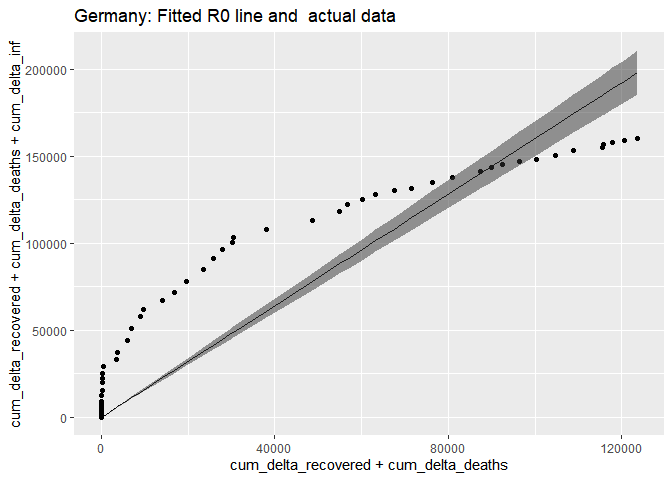

Now, we solve the actualy differential equation to fit the evolution of
the disease and forecast the time series. We intialize the values below.
We ignore the initial data because of noisiness and low scale testing.

    library(deSolve)
    library(RColorBrewer)

    Infected <- germany_inf[50:97]
    Recovered <- germany_recovered[50:97]
    Deaths <- germany_deaths[50:97]
    Confirmed <- germany_cnf[50:97]
    day <- 0:(length(Infected)-1)
    N <- 830000 

    ###edit 1: use different boundary condition
    ###init <- c(S = N-1, I = 1, R = 0)
    init <- c(S = N-Infected[1] - Recovered[1] - Deaths[1], I = Infected[1], R = Recovered[1], D = Deaths[1])

Then, we define the differential changes in the quantities with respect
to time.

    SIR <- function(time, state, parameters) {
      par <- as.list(c(state, parameters))
      ####edit 2; use equally scaled variables 
      with(par, { dS <- -alpha * (S/N) * I
      dI <- alpha * (S/N) * I - beta * I - gamma * I
      dR <- beta * I
      dD <- gamma * I
      list(c(dS, dI, dR, dD))
      })
    }

Then we define an optimizer to find the optimum parameters to fit the
confirmed cases curve with an initial guess. For this we also define a
misfit function which is a simple L2 error function. The code is given
below.

    RSS.SIR <- function(parameters) {
      names(parameters) <- c("alpha", "beta", "gamma")
      out <- ode(y = init, times = day, func = SIR, parms = parameters)
      fit <- out[ , 3] + out[ , 4] + out[ , 5]
      RSS <- sum((Confirmed- fit)^2)
      return(RSS)
    }

    lower = c(0, 0, 0)
    upper = c(10, 1, 1)  ###Limit box for parameters for L-BFGS-B

    optimsstart <- c(0.7, 0.4,  0.2) #initial guess for parameters

    set.seed(12)
    Opt <- optim(optimsstart, RSS.SIR, method = "L-BFGS-B", lower = lower, upper = upper,
                 hessian = TRUE)
    #Opt$par

Once we have optimized, we can predict the case evolution as follows.

    Opt_par <- Opt$par
    names(Opt_par) = c("alpha", "beta", "gamma")
    t <- 0:120
    fit <- data.frame(ode(y = init, times = t, func = SIR, parms = Opt_par))
    predict <- fit$I + fit$D + fit$R
    plot(t, predict, col="green", xlab="Days since March 11", ylab="Confirmed cases")  
    lines(day, Confirmed, col="red")
    title("Germany: Green is confirmed cases predicted by our model, red is actual data.")

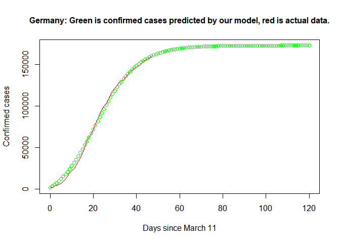

The results indicate that by the end of June, the confirmed cases will
peak and the epidemic will end in Germany.

### 4.2 Results for India

Now we repeat the same analysis for India. Note India is still in the
early phase of the disease.

We plot plot the estimates and the corresponding 99% confidence
intervals for $R\_{0}, \\hat{\\beta}, \\hat{\\gamma}$ as below.

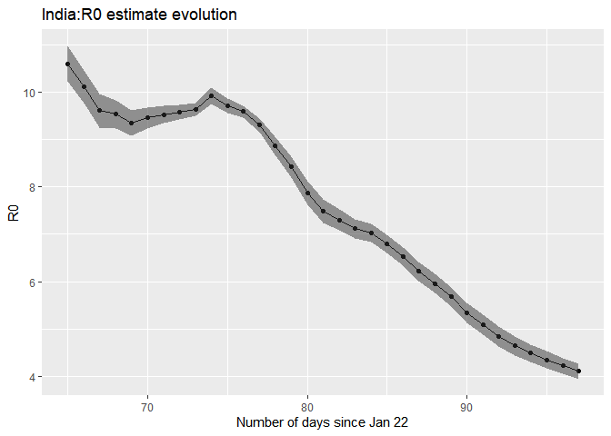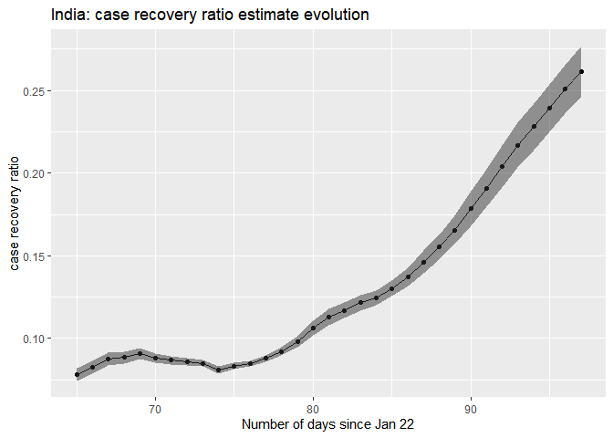

From these, we can see that the *R*0 for India has come down
from 10.6 to 4.09 (99% CI : \[3.94 4.25\]). Thus India is quite far away
from the end of the epidemic. Note that if *R*0 &lt; 1, the
disease stops spreading. The case recovery ratio is going up and has
reached approximately 0.26 while the case fatality ratio is about 0.041.

Since *R*0 is estimated by a linear model, for curiosity we
carry out some diagnostics to see how if the data actually fits to the
linear plot. We the plot out fitted slope (which is equal to
*R*0) and observe that a rather poor fit which is expected
because *R*0 changes with time.

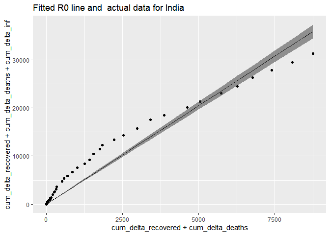

We solve the differntial equations system and fit the parameters to do
time series forecasting for the India data.

Once we have optimized, we can predict the case evolution as follows.  

The results indicate that the curve will peak in India by the end of
July.

5. Conclusions and Future work
------------------------------

In this study, we used SIRD model commonly used in epidemiology to
estimate the evolution of basic reprducibility number, case fatality
ratio and case recovery ratio as the disease progresses. We also use it
to fit the parameters to the data coming from Germany and India and use
it to predict the evolution of disease. Our results indicate that the
epidemic should end in germany by the end of June. India might have to
wait till the end of July before the peak is reached. The recovery
ratios obtained for India (about 26%) are consistent with the government
estimates recently reported in
[business-standard](https://www.business-standard.com/article/current-affairs/covid-19-factoid-india-s-recovery-rate-improves-to-30-from-10-in-april-120050900106_1.html)
. The prediction of beginning of curve flattening by July end are in
line with the recent WHO estimates given [WHO envoy
interview](https://www.ndtv.com/india-news/indias-covid-curve-likely-to-flatten-reach-peak-by-july-end-who-envoy-2225754).

6. Limitations
--------------

However, we must state here that there are several limitations to our
predictions. First, the model itself is a simplistic model to study the
disease as it assumes constant transmission rates among different
classes. Also, the model does not take into account the asymptomatic
cases which may be contributing to sopreading the disease. Secondly, the
data itself might be unreliable as there might be severe underreporting
of infected people because of lack of testing. Thirdly, the uplifting of
lockdown may accelerate the spread of disease. A more complex model with
these factors taken into account would be desirable for a better
forecasting.

7. References
-------------

\[1\] Cleo Anastassopoulou ,Lucia Russo,Athanasios Tsakris, Constantinos
Siettos," Data-based analysis, modelling and forecasting of the COVID-19
outbreak", PLOS ONE (2020)
(<https://doi.org/10.1371/journal.pone.0230405>)
