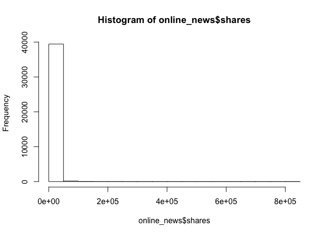
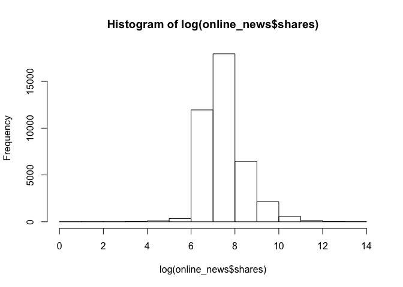

    ##### Importiing, viewing, and analizing data
    online_news <- read.csv("./online_news.csv")
    View(online_news)

    ## Warning in system2("/usr/bin/otool", c("-L", shQuote(DSO)), stdout = TRUE):
    ## running command ''/usr/bin/otool' -L '/Library/Frameworks/R.framework/Resources/
    ## modules/R_de.so'' had status 1

    str(online_news)

    ## 'data.frame':    39644 obs. of  38 variables:
    ##  $ url                          : Factor w/ 39644 levels "http://mashable.com/2013/01/07/amazon-instant-video-browser/",..: 1 2 3 4 5 6 7 8 9 10 ...
    ##  $ n_tokens_title               : int  12 9 9 9 13 10 8 12 11 10 ...
    ##  $ n_tokens_content             : int  219 255 211 531 1072 370 960 989 97 231 ...
    ##  $ num_hrefs                    : int  4 3 3 9 19 2 21 20 2 4 ...
    ##  $ num_self_hrefs               : int  2 1 1 0 19 2 20 20 0 1 ...
    ##  $ num_imgs                     : int  1 1 1 1 20 0 20 20 0 1 ...
    ##  $ num_videos                   : int  0 0 0 0 0 0 0 0 0 1 ...
    ##  $ average_token_length         : num  4.68 4.91 4.39 4.4 4.68 ...
    ##  $ num_keywords                 : int  5 4 6 7 7 9 10 9 7 5 ...
    ##  $ data_channel_is_lifestyle    : int  0 0 0 0 0 0 1 0 0 0 ...
    ##  $ data_channel_is_entertainment: int  1 0 0 1 0 0 0 0 0 0 ...
    ##  $ data_channel_is_bus          : int  0 1 1 0 0 0 0 0 0 0 ...
    ##  $ data_channel_is_socmed       : int  0 0 0 0 0 0 0 0 0 0 ...
    ##  $ data_channel_is_tech         : int  0 0 0 0 1 1 0 1 1 0 ...
    ##  $ data_channel_is_world        : int  0 0 0 0 0 0 0 0 0 1 ...
    ##  $ self_reference_min_shares    : num  496 0 918 0 545 8500 545 545 0 0 ...
    ##  $ self_reference_max_shares    : num  496 0 918 0 16000 8500 16000 16000 0 0 ...
    ##  $ self_reference_avg_sharess   : num  496 0 918 0 3151 ...
    ##  $ weekday_is_monday            : int  1 1 1 1 1 1 1 1 1 1 ...
    ##  $ weekday_is_tuesday           : int  0 0 0 0 0 0 0 0 0 0 ...
    ##  $ weekday_is_wednesday         : int  0 0 0 0 0 0 0 0 0 0 ...
    ##  $ weekday_is_thursday          : int  0 0 0 0 0 0 0 0 0 0 ...
    ##  $ weekday_is_friday            : int  0 0 0 0 0 0 0 0 0 0 ...
    ##  $ weekday_is_saturday          : int  0 0 0 0 0 0 0 0 0 0 ...
    ##  $ weekday_is_sunday            : int  0 0 0 0 0 0 0 0 0 0 ...
    ##  $ is_weekend                   : int  0 0 0 0 0 0 0 0 0 0 ...
    ##  $ global_rate_positive_words   : num  0.0457 0.0431 0.0569 0.0414 0.0746 ...
    ##  $ global_rate_negative_words   : num  0.0137 0.01569 0.00948 0.02072 0.01213 ...
    ##  $ avg_positive_polarity        : num  0.379 0.287 0.496 0.386 0.411 ...
    ##  $ min_positive_polarity        : num  0.1 0.0333 0.1 0.1364 0.0333 ...
    ##  $ max_positive_polarity        : num  0.7 0.7 1 0.8 1 0.6 1 1 0.8 0.5 ...
    ##  $ avg_negative_polarity        : num  -0.35 -0.119 -0.467 -0.37 -0.22 ...
    ##  $ min_negative_polarity        : num  -0.6 -0.125 -0.8 -0.6 -0.5 -0.4 -0.5 -0.5 -0.125 -0.5 ...
    ##  $ max_negative_polarity        : num  -0.2 -0.1 -0.133 -0.167 -0.05 ...
    ##  $ title_subjectivity           : num  0.5 0 0 0 0.455 ...
    ##  $ title_sentiment_polarity     : num  -0.188 0 0 0 0.136 ...
    ##  $ abs_title_sentiment_polarity : num  0.188 0 0 0 0.136 ...
    ##  $ shares                       : int  593 711 1500 1200 505 855 556 891 3600 710 ...

    ##### Regress first and threshold second

    hist(online_news$shares) 

    # We should apply the log transformation since shares is very skewed 

    # After log transformation
    hist(log(online_news$shares))

